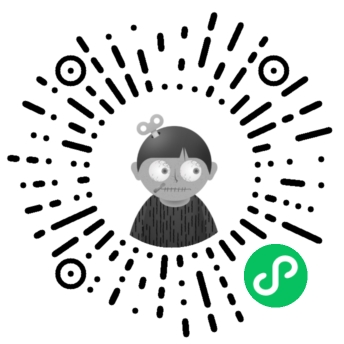
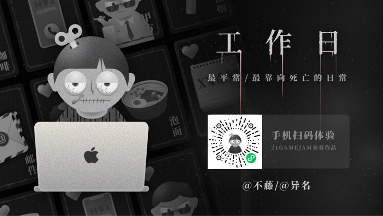
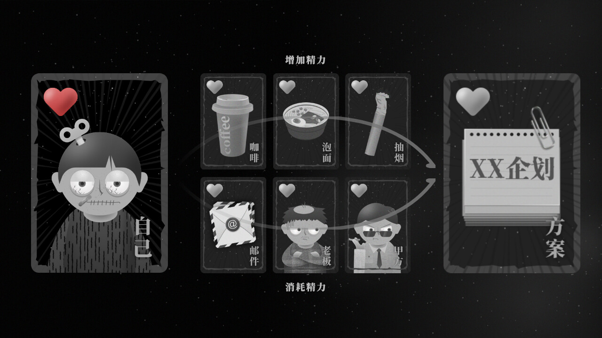
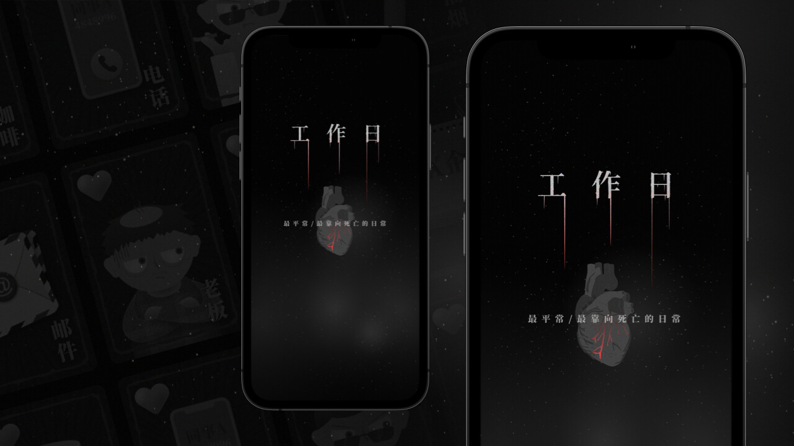
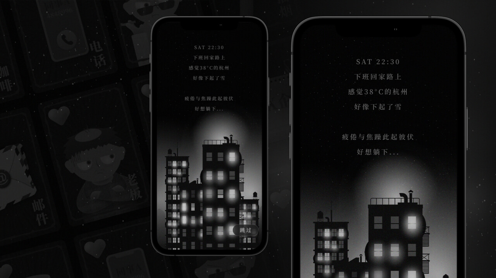
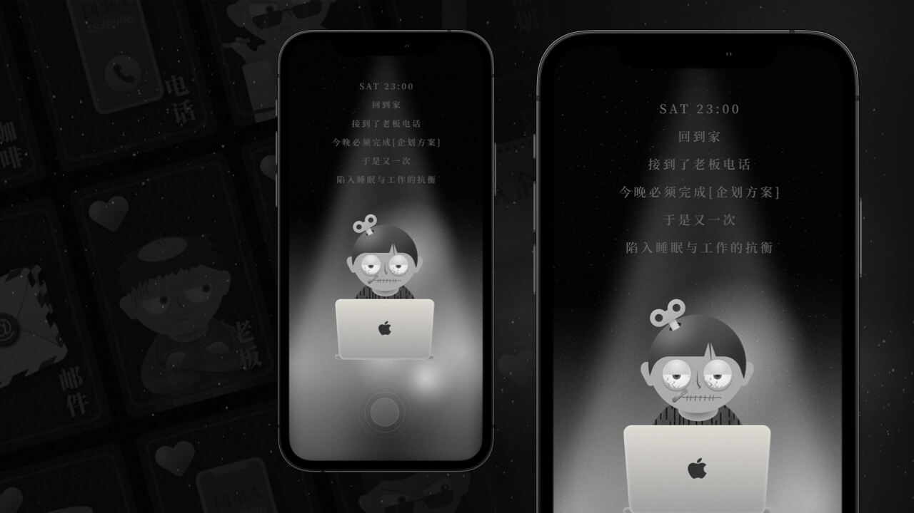
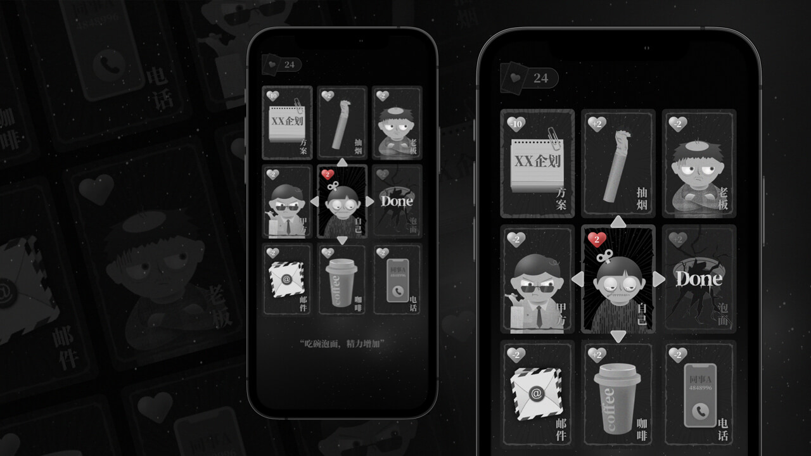
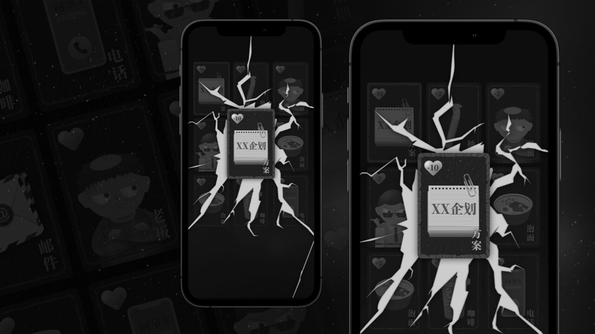
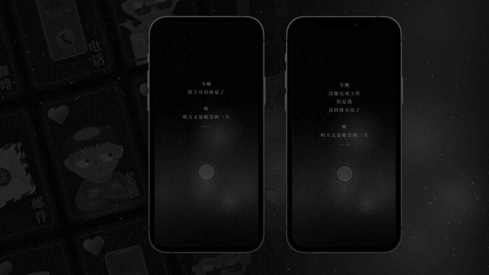

# Weekday

工作日这款小游戏是异名参加"2021GameJam线下48小时极限游戏开发的作品"，用的游戏引擎是Cocos Creator 2.4.3，项目直接在对应的引擎版本中启动即可

> 游戏围绕“脱轨/无用功/麻木”等主题抽象词

> 希望以“游戏”“故事”的方式表达社畜最日常的生活，一种对于过多工作的麻木，对于现状的无力感，以及生活失衡所造成的“脱轨生活”；

> 通过简单的卡牌游戏与具象可视化，以深夜加班为故事背景，用户通过精力的获取与消耗度过加班的夜晚；

> 最后，所有麻木与超负荷的日常，不过就是一日一日的循环往复

目前游戏已经发布到了微信小游戏中，体验二维码：

